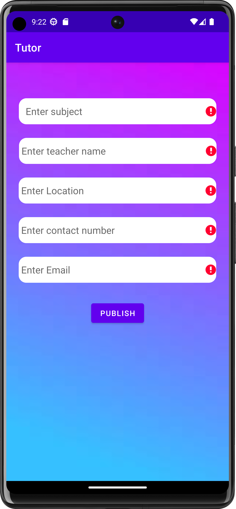
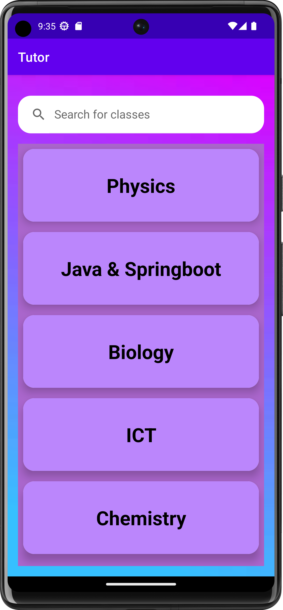

# EduConnect - Mobile App for Academic Support and Exam Preparation

## Introduction

In today's rapidly evolving digital age, mobile applications have become an integral part of our daily lives. The current economic crisis has had a profound impact on education, leading to a shift towards online learning. In this context, our mobile app provides a comprehensive solution for students to find past papers and connect with qualified tutors for academic assistance. Our app is designed to cater to the needs of students and tutors alike, with four distinct modules.

## Features
- User management: allowing users to register, login and manage their profiles.
- Student management: enabling students to post advertisements seeking tutors.
- Tutor management: where tutors can advertise their classes.
- Paper management: allowing managers to upload question papers and answer sheets.

The app provides a convenient and cost-effective way for students to access a wide range of academic resources and find tutors. Additionally, it offers an opportunity for tutors to showcase their skills and monetize their expertise by offering online classes. In these challenging economic times, our app offers a practical solution for students seeking academic assistance and tutors looking for additional income.

## Group Members
| Group Members                   | Student ID    |    Function              |
|------------------------         |------------   |------------------   |
| Tharaka P.D.G. (Group Leader)   | IT21181092    |  Tutor management   |
| Herath H.M.M. D                 | IT21173240    |  Student management |
| Chaturanga K.H. D               | IT21168772    |  Paper management   |
| Karunarathne D.G.V. S           | IT21785610    |  User management    |

## Group Information
- Group Name: EduConnect_GROUP_MAD_WD_B03.02
- Module: IT2010 - Mobile Application Development (MAD)

 ## Screenshots

*Caption for Dashboard*

*Caption for Insert*

*Caption for Insert Validation*

*Caption for Search Class*

*Caption for Update*

*Caption for View Classes*

*Caption for View Details Class*
